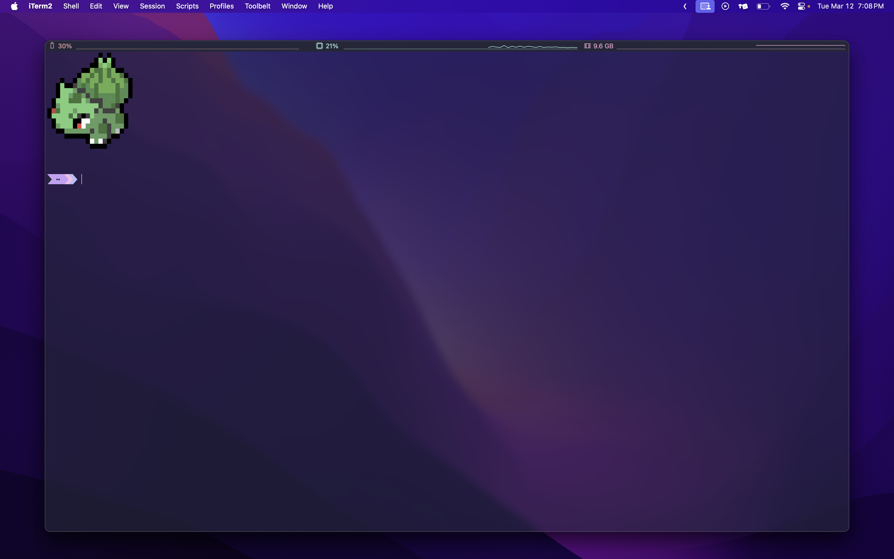
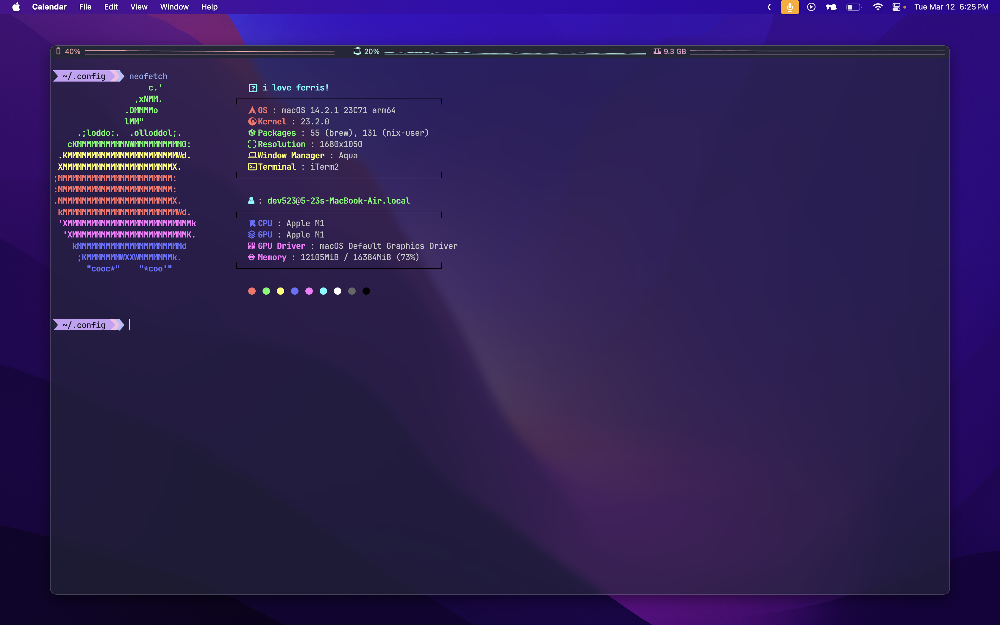
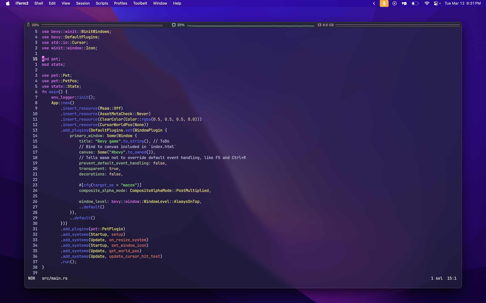

# Dotfiles
mac-os dotfile

## download
[download __stonyite__](https://github.com/5-23/stonyite)
```bash
git clone https://github.com/5-23/dotfiles-mac/
cd ./dotfiles-mac
stonyite setup
```

## preview
- terminal

- neofetch

- helix
